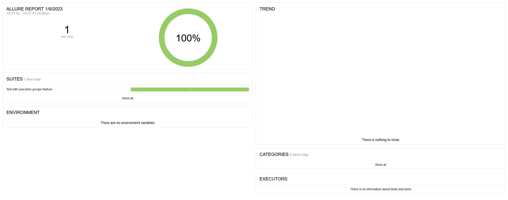
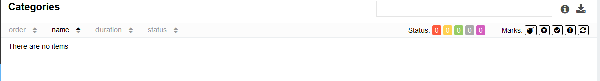
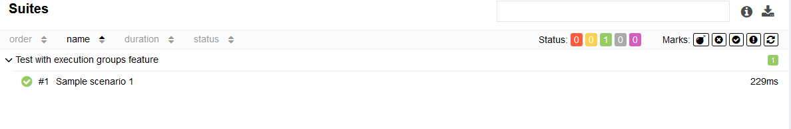
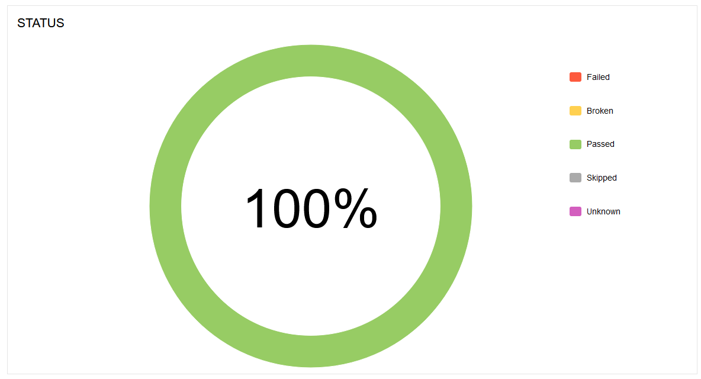
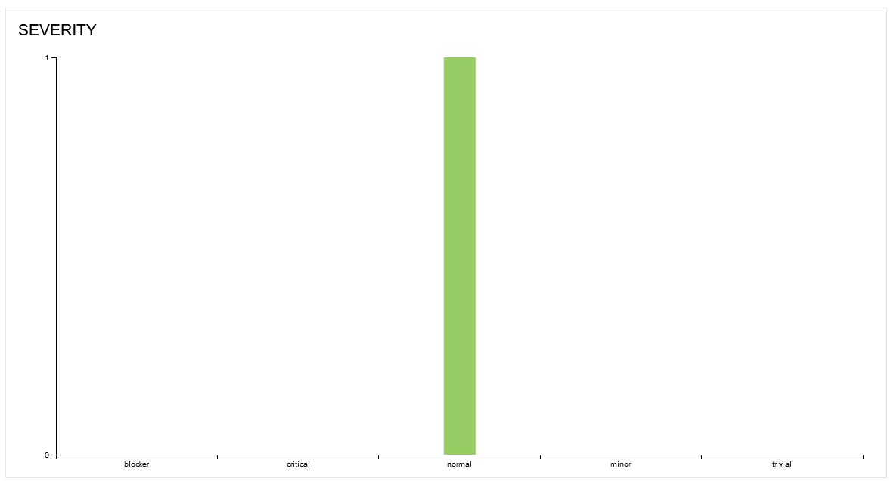
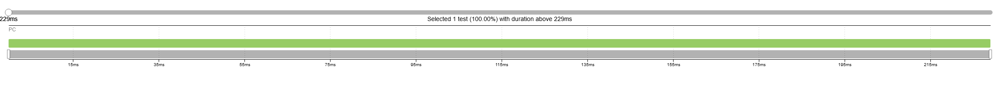

# Test-automation-selenide

### Setup

Import module to your project:
   * Maven - add the dependency to your project pom.xml:
   
   `<dependency> 
     <groupId>com.nortal.test</groupId>
     <artifactId>test-automation-selenide</artifactId>
     <version>${test.framework.version}</version>
   </dependency>`

   * Gradle - add the dependency to your project build.gradle.kts:
   
   `testImplementation("com.nortal.test:test-automation-selenide:${testAutomationFrameworkVersion}")`

### Reporting

* After tests are run it is possible to check the generated step screenshots and report:

`build/allure-report/index.html`

* Within the Report you are able to see:
  * Overview
  
  * Categories
  
  * Suites
  
  * Graphs with information on:
    * Severity
    * Duration
    * Duration, Retries, Categories Trends
  
  
  * Timeline
  
  * Logs

  NOTE: to avoid CORS issues use http server. (IntelliJ can provide one OOTB)
  An alternative would be to enable direct report serving through test-automation.report.allure.serve-report.enabled=true

### Additional information:

* Module is for Front-End testing using JAVA 8+
* More info on Selenide [here](https://selenide.org/documentation.html), [git](https://github.com/selenide/selenide)

